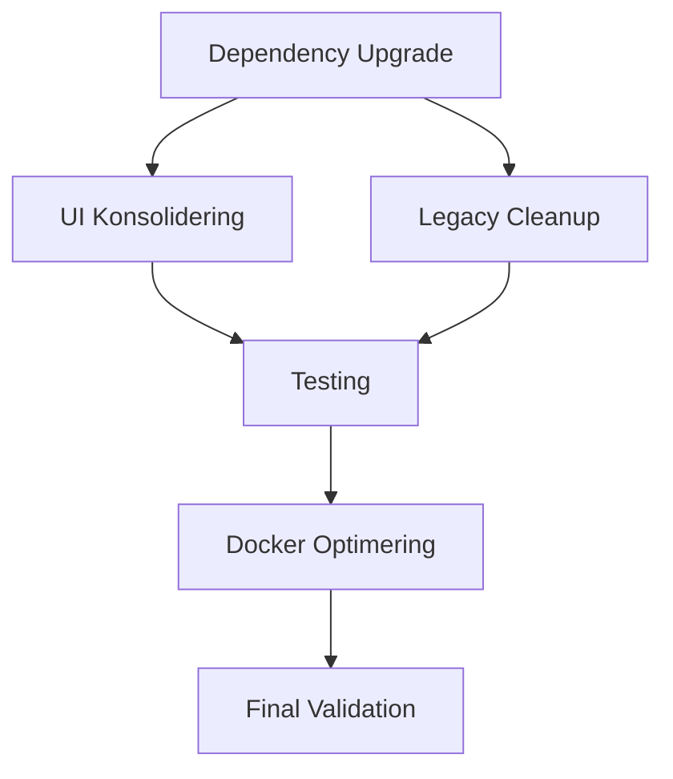

# 🚀 MASTER IMPLEMENTERING & KOORDINATIONSPLAN

## 📋 EXECUTIVE SUMMARY

Dette er den overordnede plan for komplet refaktorering og optimering af LearningLab monorepo'et. Planen koordinerer alle delplaner og sikrer en systematisk tilgang til at opnå en fejlfri, optimeret og vedligeholdelsesvenlig platform.

## 🎯 OVERORDNEDE MÅL

### Primære Mål
1. **Fejlfri Platform**: 0 TypeScript fejl, 0 ESLint fejl, 0 sikkerhedssårbarheder
2. **Optimeret Performance**: 50% hurtigere builds, 40% mindre bundle størrelse
3. **Vedligeholdelsesvenlig**: Single UI system, locked dependencies, clear struktur
4. **Production Ready**: Optimeret Docker setup, monitoring, sikkerhed

### Success Metrics
- **Code Quality**: 100% TypeScript coverage, 80%+ test coverage
- **Performance**: Build time < 5 min, startup time < 30 sek
- **Security**: 0 vulnerabilities, best practice implementation
- **Maintainability**: Single source of truth, clear documentation

## 📊 KODEBASE ANALYSE OVERSIGT

### Nuværende Tilstand
```
📁 Struktur: Turborepo monorepo med 2 apps, 5 packages
📄 Filer: ~698 TypeScript/JavaScript filer
🔧 Tools: Yarn 4.9.1, Turbo 2.5.3, TypeScript 5.3.3
🐳 Docker: Grundlæggende multi-stage setup
🎨 UI: Duplikerede systemer (MUI + Shadcn)
📦 Dependencies: Inkonsistente versioner, manglende locks
```

### Identificerede Problemer
1. **UI Duplikering**: packages/ui (MUI) vs apps/web/src/components/ui (Shadcn)
2. **Dependency Hell**: Inkonsistente versioner, sikkerhedssårbarheder
3. **Legacy Files**: ~30% af filer er forældede eller duplikerede
4. **Docker Issues**: Ikke-optimerede images, manglende security
5. **Type Safety**: Manglende strict mode, incomplete coverage

## 🗓️ MASTER TIDSPLAN (14 DAGE)

### Uge 1: Fundament & Analyse
```
Dag 1-2:  Analyse & Forberedelse
Dag 3-4:  Dependency Upgrade
Dag 5-6:  UI Konsolidering Start
Dag 7:    Legacy Cleanup
```

### Uge 2: Optimering & Finalisering
```
Dag 8-9:  UI Konsolidering Færdig
Dag 10-11: Docker Optimering
Dag 12-13: Testing & Validation
Dag 14:   Dokumentation & Deployment
```

## 📋 DETALJERET IMPLEMENTERINGSPLAN

### 🔍 FASE 1: ANALYSE & FORBEREDELSE (Dag 1-2)

#### Dag 1: Baseline & Backup
```bash
# 1. Opret backup
git add -A
git commit -m "Pre-refactoring baseline"
git tag "baseline-$(date +%Y%m%d)"

# 2. Kør baseline tests
yarn test:ci
yarn typecheck
yarn lint
yarn build

# 3. Generer metrics
echo "Baseline Metrics:" > BASELINE_METRICS.md
echo "Files: $(find . -name '*.ts' -o -name '*.tsx' | wc -l)" >> BASELINE_METRICS.md
echo "Size: $(du -sh . | cut -f1)" >> BASELINE_METRICS.md
echo "Build time: $(time yarn build 2>&1 | grep real)" >> BASELINE_METRICS.md
```

#### Dag 2: Dependency Audit
```bash
# 1. Security audit
yarn audit --all > security-audit.txt
npm audit --audit-level high >> security-audit.txt

# 2. Outdated packages
yarn outdated > outdated-packages.txt

# 3. Duplicate code analysis
npx jscpd --min-lines 10 --min-tokens 50 apps/ packages/ > duplicate-code.txt

# 4. Bundle analysis
yarn workspace web build
npx @next/bundle-analyzer
```

### 🔄 FASE 2: DEPENDENCY UPGRADE (Dag 3-4)

#### Dag 3: Core Framework Upgrades
```bash
# 1. Node.js upgrade
nvm install 22.0.0
nvm use 22.0.0
echo "22.0.0" > .nvmrc

# 2. React ecosystem
yarn add react@18.2.0 react-dom@18.2.0
yarn add -D @types/react@18.2.18 @types/react-dom@18.2.18

# 3. Next.js upgrade
yarn workspace web add next@14.2.0

# 4. Test efter hver upgrade
yarn typecheck && yarn build
```

#### Dag 4: Backend & Tools Upgrades
```bash
# 1. NestJS upgrade (major version)
yarn workspace api add @nestjs/core@11.1.1 @nestjs/common@11.1.1

# 2. TypeScript upgrade
yarn add -D typescript@5.4.5

# 3. Lock versions i root package.json
# Se DEPENDENCY_UPGRADE_PLAN.md for detaljer

# 4. Regenerate lockfile
rm yarn.lock
yarn install
```

### 🎨 FASE 3: UI KONSOLIDERING (Dag 5-9)

#### Dag 5-6: Komponent Enhancement
```bash
# 1. Enhance MUI komponenter med Shadcn funktionalitet
# Se UI_KONSOLIDERING_PLAN.md for detaljer

# 2. Test hver komponent
yarn workspace ui test

# 3. Update Storybook
yarn storybook:build
```

#### Dag 7: Legacy Cleanup
```bash
# 1. Kør automated cleanup script
chmod +x cleanup.sh
./cleanup.sh

# 2. Manual review af arkiverede filer
# Se LEGACY_CLEANUP_PLAN.md for detaljer

# 3. Update .gitignore
echo "archive/" >> .gitignore
```

#### Dag 8-9: Import Migration
```bash
# 1. Automated import replacement
# Se UI_KONSOLIDERING_PLAN.md for scripts

# 2. Manual testing af alle sider
yarn workspace web dev
# Test alle routes manuelt

# 3. Remove old UI components
rm -rf apps/web/src/components/ui/
```

### 🐳 FASE 4: DOCKER OPTIMERING (Dag 10-11)

#### Dag 10: Dockerfile Optimization
```bash
# 1. Opret optimerede Dockerfiles
# Se DOCKER_OPTIMERING_PLAN.md for detaljer

# 2. Test builds
docker build -f docker/api/Dockerfile -t learninglab/api:test .
docker build -f docker/web/Dockerfile -t learninglab/web:test .

# 3. Size comparison
docker images | grep learninglab
```

#### Dag 11: Docker Compose & Security
```bash
# 1. Setup secrets
mkdir -p secrets
openssl rand -base64 32 > secrets/postgres_password.txt
openssl rand -base64 32 > secrets/redis_password.txt
openssl rand -base64 64 > secrets/jwt_secret.txt

# 2. Test production compose
docker-compose -f docker-compose.prod.yml up -d

# 3. Health checks
curl http://localhost/health
```

### 🧪 FASE 5: TESTING & VALIDATION (Dag 12-13)

#### Dag 12: Comprehensive Testing
```bash
# 1. Unit tests
yarn test:ci --coverage

# 2. Integration tests
yarn test:e2e

# 3. Performance testing
yarn build
lighthouse http://localhost:3000

# 4. Security testing
docker run --rm -v $(pwd):/app clair-scanner
```

#### Dag 13: Load Testing & Optimization
```bash
# 1. Load testing
k6 run load-test.js

# 2. Bundle analysis
yarn workspace web build
npx @next/bundle-analyzer

# 3. Performance profiling
yarn workspace api start:prod &
clinic doctor -- node apps/api/dist/main.js
```

### 📚 FASE 6: DOKUMENTATION & DEPLOYMENT (Dag 14)

#### Dag 14: Finalisering
```bash
# 1. Update documentation
# Se alle README filer
# Update API documentation

# 2. Final tests
yarn test:ci
yarn build
docker-compose -f docker-compose.prod.yml up -d

# 3. Deployment preparation
# Setup CI/CD pipelines
# Configure monitoring

# 4. Success metrics
echo "Final Metrics:" > FINAL_METRICS.md
echo "Files: $(find . -name '*.ts' -o -name '*.tsx' | wc -l)" >> FINAL_METRICS.md
echo "Size: $(du -sh . | cut -f1)" >> FINAL_METRICS.md
echo "Build time: $(time yarn build 2>&1 | grep real)" >> FINAL_METRICS.md
```

## 🔧 KOORDINATION & AFHÆNGIGHEDER

### Kritiske Afhængigheder


### Parallel Opgaver
- Legacy cleanup kan køres parallelt med dependency upgrades
- Docker optimering kan forberedes mens UI konsolidering pågår
- Dokumentation kan skrives løbende

### Risk Mitigation
- Git tags efter hver fase for rollback mulighed
- Incremental testing efter hver ændring
- Backup af kritiske konfigurationer
- Parallel development environment

## 📊 PROGRESS TRACKING

### Daily Checklist Template
```markdown
## Dag X Progress

### Completed ✅
- [ ] Task 1
- [ ] Task 2

### In Progress 🔄
- [ ] Task 3

### Blocked ❌
- [ ] Task 4 (reason)

### Metrics
- Build time: X minutes
- Test coverage: X%
- Bundle size: X MB
- TypeScript errors: X

### Notes
- Issues encountered
- Decisions made
- Next day priorities
```

### Success Tracking
```bash
# Daily metrics script
#!/bin/bash
echo "=== Daily Metrics $(date) ===" >> daily-metrics.log
echo "TypeScript errors: $(yarn typecheck 2>&1 | grep -c 'error')" >> daily-metrics.log
echo "ESLint errors: $(yarn lint 2>&1 | grep -c 'error')" >> daily-metrics.log
echo "Test coverage: $(yarn test:ci --coverage --silent | grep 'All files' | awk '{print $10}')" >> daily-metrics.log
echo "Build time: $(time yarn build 2>&1 | grep real | awk '{print $2}')" >> daily-metrics.log
echo "Bundle size: $(du -sh apps/web/.next | cut -f1)" >> daily-metrics.log
echo "---" >> daily-metrics.log
```

## 🚨 RISK MANAGEMENT

### High Risk Areas
1. **NestJS 10→11 Upgrade**: Breaking changes mulige
2. **UI System Migration**: Potentiel visual regression
3. **Docker Changes**: Deployment issues mulige
4. **Dependency Conflicts**: Version incompatibilities

### Mitigation Strategies
```bash
# 1. Incremental rollback points
git tag "phase-1-complete"
git tag "phase-2-complete"
# etc.

# 2. Parallel testing environment
docker-compose -f docker-compose.test.yml up -d

# 3. Feature flags for gradual rollout
# Implement feature toggles for major changes

# 4. Automated rollback scripts
#!/bin/bash
# rollback.sh
git reset --hard $1  # tag name
yarn install
docker-compose down
docker-compose up -d
```

## 📋 MASTER CHECKLIST

### Pre-Implementation
- [ ] Team alignment on plan
- [ ] Development environment setup
- [ ] Backup strategy confirmed
- [ ] Testing strategy defined

### Phase 1: Analysis (Dag 1-2)
- [ ] Baseline metrics captured
- [ ] Security audit completed
- [ ] Dependency analysis done
- [ ] Code duplication identified

### Phase 2: Dependencies (Dag 3-4)
- [ ] Node.js upgraded
- [ ] React ecosystem updated
- [ ] Next.js upgraded
- [ ] NestJS upgraded
- [ ] TypeScript updated
- [ ] Versions locked

### Phase 3: UI Consolidation (Dag 5-9)
- [ ] MUI components enhanced
- [ ] Shadcn functionality merged
- [ ] Imports migrated
- [ ] Old components removed
- [ ] Tests passing

### Phase 4: Docker (Dag 10-11)
- [ ] Dockerfiles optimized
- [ ] Security implemented
- [ ] Compose files updated
- [ ] Health checks added
- [ ] Secrets configured

### Phase 5: Testing (Dag 12-13)
- [ ] Unit tests passing
- [ ] Integration tests passing
- [ ] E2E tests passing
- [ ] Performance benchmarks met
- [ ] Security scan clean

### Phase 6: Finalization (Dag 14)
- [ ] Documentation updated
- [ ] Deployment ready
- [ ] Monitoring configured
- [ ] Success metrics achieved

## 🎯 SUCCESS CRITERIA

### Technical Excellence
- [ ] 0 TypeScript errors
- [ ] 0 ESLint errors  
- [ ] 0 security vulnerabilities
- [ ] 80%+ test coverage
- [ ] Build time < 5 minutes
- [ ] Bundle size reduced 40%+

### Code Quality
- [ ] Single UI system
- [ ] Locked dependencies
- [ ] Clean project structure
- [ ] Comprehensive documentation
- [ ] Best practices implemented

### Operational Excellence
- [ ] Optimized Docker setup
- [ ] Health monitoring
- [ ] Security best practices
- [ ] Automated deployments
- [ ] Disaster recovery plan

---

## 🚀 NEXT STEPS

1. **Review & Approve**: Gennemgå denne plan med teamet
2. **Resource Allocation**: Tildel dedikerede ressourcer
3. **Environment Setup**: Forbered development environment
4. **Kickoff Meeting**: Start implementeringen
5. **Daily Standups**: Daglige progress reviews

---

*Denne master plan sikrer en koordineret, systematisk og succesfuld transformation af LearningLab platformen til en world-class, production-ready løsning.*