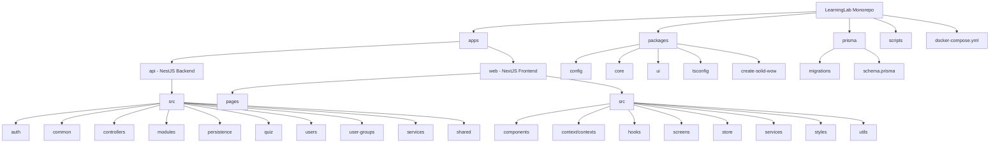
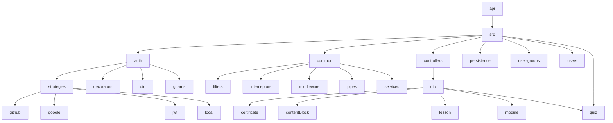
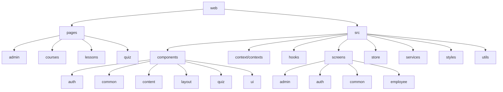
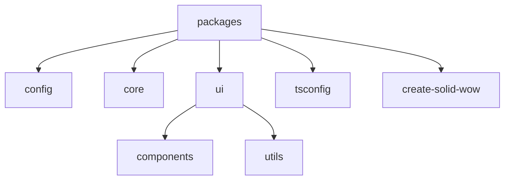
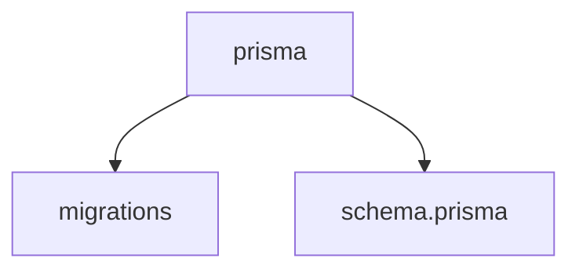
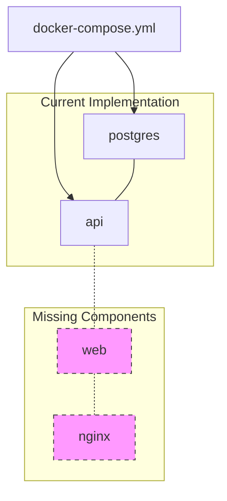

# LearningLab Project Structure Diagram

## Overview

This document provides visual diagrams of the LearningLab project structure to complement the guidelines.md file.

## High-Level Architecture

## API Structure Detail

## Web Application Structure Detail

## Package Structure Detail

## Database Structure

## Deployment Architecture

Note: Dashed components are mentioned in the guidelines but not implemented in the current docker-compose.yml file.